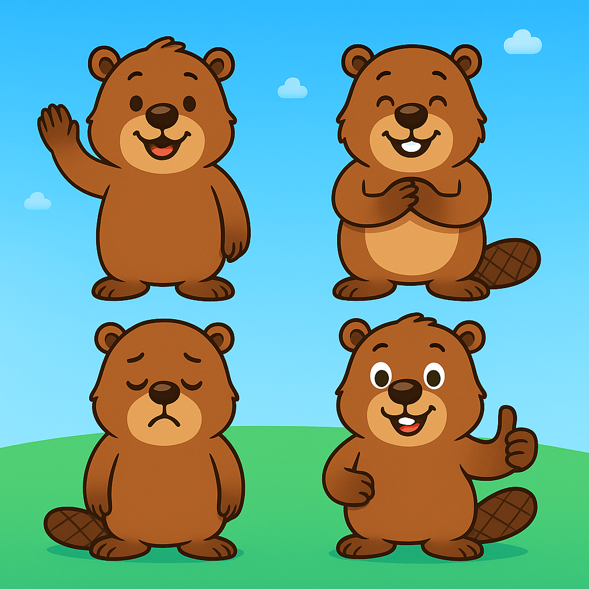

# Project Beaver

A series of games for kids 5~12 years old, as a web app built with **Next.js**, hosted on **Netlify**.



## 🚀 Getting Started

Install dependencies:

```bash
npm install
```

Start the dev server:

```bash
npm run dev
```

Open [http://localhost:3000](http://localhost:3000)
